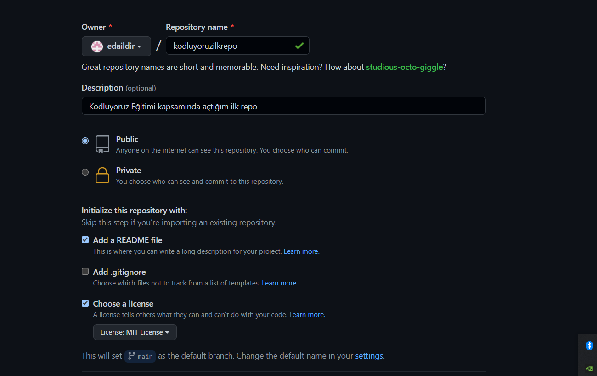

# kodluyoruzilkrepo
Bu repo [Kodluyoruz](https://www.kodluyoruz.org/) Front-End Eğitiminde oluşturduğumuz ilk repo. İçerisinde bir adet README dosyası, bir adet de index.html barındırıyor.

## Installation
Öncelikle projeyi clonelayın. 

>[Repoya Buraya tıklayarak ulaşabilirsiniz.](https://github.com/edaildir/kodluyoruzilkrepo)
>

## Usage
Projeyi cloneladıktan sonra Visual Studio Code programında açınız.

Linux için:
>`cd kodluyoruzilkrepo`
>`code .`
